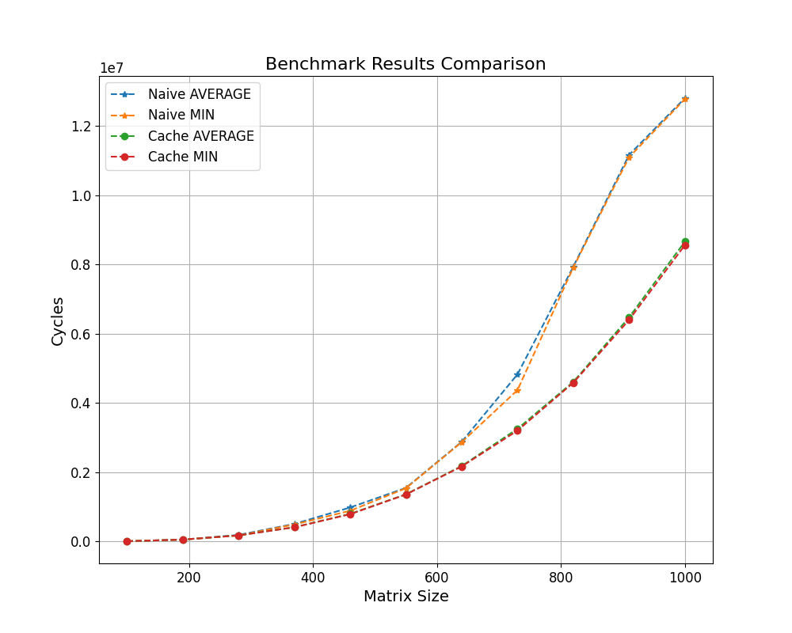

# Fast Matrix Multiplication (MatMul)

This project implements a faster matrix multiplication algorithm inspired by [this
article](https://github.com/salykova/matmul.c). The goal is to optimize matrix
multiplication tailored for my hardware.

## System Specifications

The benchmarks were conducted on the following hardware and software:

- **CPU**: x86_64, 2 Cores, 2 Threads  
  - Base Frequency: 1.6 GHz  
  - Turbo Frequency: 2.5 GHz  
  - Cache:  
    - L1: 64 KiB (per core)  
    - L2: 512 KiB (per core)  
    - L3: 3 MiB (shared)  
- **RAM**: 4 GB DDR3 (1333 MT/s)  
- **OS**: Linux 5.15.0-126-generic  
- **Compiler**: Ubuntu Clang 14.0.0  
- **Library**: NumPy 1.26.1  

## Algorithms

### 1. **Naive Matrix Multiplication**
- **Function**: `naive_matmul` in `matrix.c`
- **Description**:  Multiplies each row of the left matrix with each column of the right
  matrix and stores the result in the corresponding row and column of the output matrix.

### 2. **Cache-Optimized Matrix Multiplication**
- **Function**: `cache_matmul` in `matrix.c`
- **Optimization Goal**:  Minimize cache misses by exploiting spatial locality. When
  accessing matrix elements column-wise, cache misses occur frequently, as cache lines are
  optimized for contiguous memory blocks. The cache-aware algorithm reduces these misses.

#### **How It Works:**
- Each element of the first matrix row is multiplied with the corresponding row of the second matrix.
- The results are accumulated into the appropriate position in the output matrix.

#### **Example (2x2 Matrices):**
```
Input: Matrix A Matrix B [[a, b], [[e, f], [c, d]] [g, h]]

Step-by-Step:

Take a (row 1, col 1 of A) and multiply it with row 1 of B: [[ae, af], [0, 0]]

Take b (row 1, col 2 of A) and multiply it with row 2 of B, accumulating: [[ae + bg, af + bh], [0, 0]]

Repeat for row 2 of A: [[ae + bg, af + bh], [ce + dg, cf + dh]]
```

### **Benchmark Comparison**
Below is a benchmark comparing the naive and cache-optimized implementations. The results
show that for small matrices, both methods perform similarly due to minimal cache misses.
As matrix sizes grow, the cache-optimized implementation significantly outperforms the
naive one.


